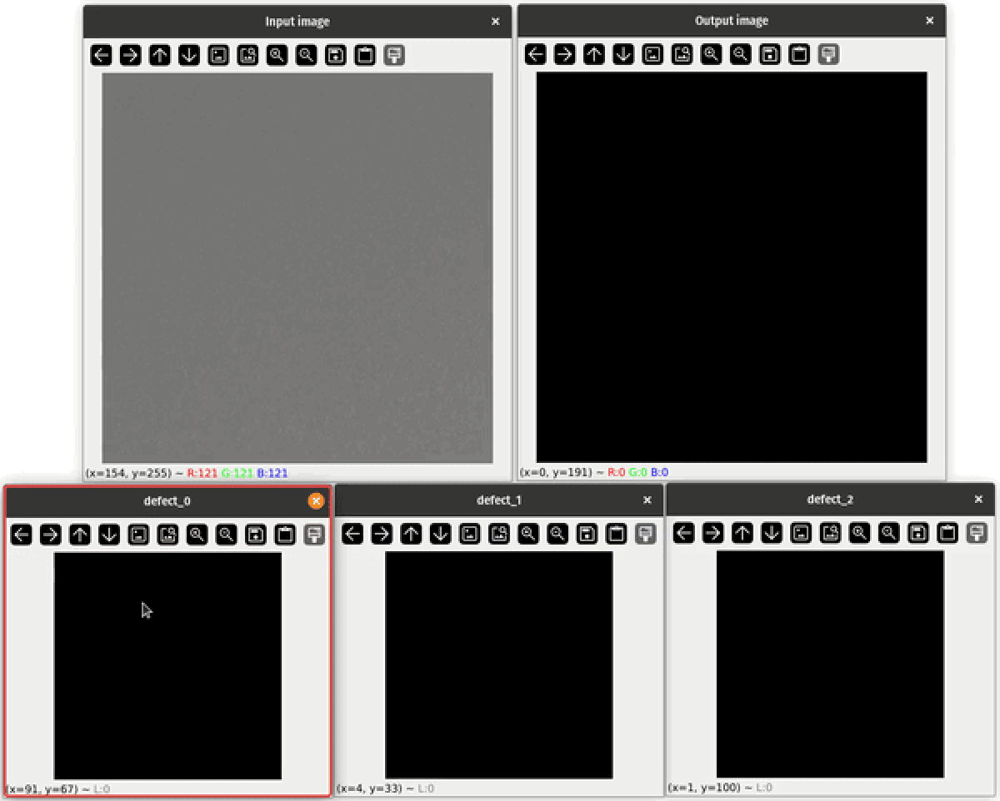
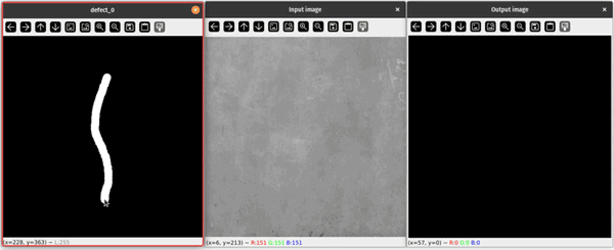

</br></br></br></br>
<h1> COIGAN: Controllable Object Inpainting through Generative Adversarial Network applied to Defect Synthesis for Data Augmentation</h1>
</br>

Revisited COIGAN project for the IROS 2024 conference. This project exploit the COIGAN training architecture to generate a dataset of defected images from a dataset of images from the new Morandi bridge located at Genova.

# Table of Contents
- [Table of Contents](#table-of-contents)
- [Model results](#model-results)
  - [Sample results](#sample-results)
  - [Dataset used for the training](#dataset-used-for-the-training)
    - [Concrete Crack Conglomerate Dataset](#concrete-crack-conglomerate-dataset)
    - [Severstal Steel Defect Detection dataset](#severstal-steel-defect-detection-dataset)
  - [Fid evaluation](#fid-evaluation)
- [Build the Docker image](#build-the-docker-image)
  - [Setup the build\_args file](#setup-the-build_args-file)
  - [Build the Docker image](#build-the-docker-image-1)
- [Run the Docker image](#run-the-docker-image)
- [Prepare the Severstal steel defect detection dataset](#prepare-the-severstal-steel-defect-detection-dataset)
- [Run the training](#run-the-training)
  - [Training settings](#training-settings)
  - [The losses](#the-losses)
- [Run the evaluation](#run-the-evaluation)
- [Run the inference](#run-the-inference)

# Model results

## Sample results
Some results showing the effectiveness of the COIGAN model in generating defected over base images, in different contexts:



<figcaption style="text-align:center;">Results obtained from a COIGAN model trained on the Severstal steel defect detection dataset, using base images from the San Giorgio viaduct (Genoa, Italy).</figcaption>
</br></br>


<figcaption style="text-align:center;">Results obtained from a COIGAN model trained on the Concrete Crack Conglomerate Dataset, using base images from the San Giorgio viaduct (Genoa, Italy).</figcaption>
</br></br>

## Dataset used for the training

### Concrete Crack Conglomerate Dataset
The Conglomerate concrete crack dataset is a collection of images that focuses on detecting cracks in concrete structures. This dataset is widely used in the field of civil engineering and infrastructure inspection. It contains a variety of images showcasing different types and severities of cracks in concrete. It's a segmentation dataset, and contain only one class of defects: cracks, plus the background. This dataset is composed by a training set of 9,899 and a validation set composed by 1,096 images.

### Severstal Steel Defect Detection dataset
The Severstal steel defect detection dataset is designed for the task of detecting defects in steel surfaces. It consists of images capturing various types of defects that can occur during the manufacturing steel plates. The classes are 4 and are unlabeled, they are just numbers from 1 to 4. This dataset is composed by a 12,568 images with a shape of 256x1600 pixels. In this test we tiled the images in 7 slightly overlapping images of 256x256 pixels, to have a more manageable dataset, in the context of the COIGAN pipeline.

## Fid evaluation
The fid score calculated for the two datasets used for the training of the COIGAN model, are shown in the following figure.
The FID score was calculated between the training set and the generated images for the Severstal steel defect detection dataset. For the Concrete Crack Conglomerate Dataset a different setting was needed, the heavy difference between the training set and the base set used for the generation of the defected images brought us to chose to calculate the FID score between the generated images and the base images of the set, to have a more meaningful result, as drawback the base images available were only 1305, justifying the high value of the FID score.

<figure>
  <div style="display: flex; justify-content: center;">
    
  </div>
  <figcaption style="text-align:center;">FID results calculated on the COIGAN model trained on the Severstal steel defect detection dataset, and the Concrete Crack Conglomerate Dataset.
  </figcaption>
</figure>
</br>

# Build the Docker image

## Setup the build_args file
Before launching the build of the Docker image, you need to setup the `build_args.txt` file. This file contains the arguments used by the Dockerfile to build the image. The file is structured as follows:
```bash
--build-arg KAGGLE_USERNAME=<username>
--build-arg KAGGLE_KEY=<key>
--build-arg WANDB_API_KEY=<wandb_key>
```
where `<username>` and `<key>` are the username and the key of your Kaggle account. You can find them in the `Account` section of your Kaggle profile.
The `<wandb_key>` is the key of your Weights and Biases account. You can find it in the `Settings` section of your Weights and Biases profile.

## Build the Docker image
To build the Docker image, run the following command from the path ../COIGAN-IROS-2024/Docker:
```bash
docker build $(cat build_args.txt) -t coigan-iros-2024 .
```

# Run the Docker image
To run the Docker image, you need to create and modify two files in the folder `../COIGAN-IROS-2024/Docker` needed to create a shared volume between the container and the host, so the checkpoints and the logs will be saved outside the container. the files to create are:

- `experiments_path.txt` containing the path to the folder where the experiments will be saved.
- `datasets_path.txt` containing the path to the folder where the datasets are stored.
  
experiments_path.txt content example, change it with your absolute path:
```txt
/vrai-lab/IROS/COIGAN-IROS-2024/experiments
```

datasets_path.txt content example, change it with your absolute path:
```txt
/vrai-lab/IROS/COIGAN-IROS-2024/datasets
```

Then run the following command from the same path:
```bash
bash run.sh
```

Make sure to change the settings in the `run.sh` file to match your needs, as the number of GPUs, the name of the container, the name of the image.

# Prepare the Severstal steel defect detection dataset
Before running the training, you need to download the Severstal steel defect detection dataset and prepare it for the training, don't worry, the procedure is automated. To do so, you just need to adjust the dataset preparation settings if needed, in the file `../COIGAN-IROS-2024/configs/data_preparation/severstal_dataset_preparation.yaml`. 
The file contain many settings the most relevant are the following:

- **dataset_name**: name of the dataset, it will be used to create the folder where the generated dataset will be saved. The actual path will be `/<your_path>/COIGAN-controllable-object-inpainting/datasets/severstal-steel-defect-detection/<dataset_name>`
- **repo_dir**: path of the repo in your local, specify the main path of the COIGAN repo, es: `/<your_path>/COIGAN-controllable-object-inpainting`.
- **original_tile_size**: size of the original tile, for original tile is intended the dimension of the images in the input dtaset, for the severstal dataset is 1600x256, do not change this value.
- **tile_size**: size of the tile that will be generated, the tile will be cropped from the original tile, so the tile size must be smaller than the original tile size. This can be changed if you want a model with a different output shape.
- **binary**: This parameter specify if the datasets generated will be in binary json format, if set to True the read(+30%) and write(+150%) operations will be faster, and the dataset will be smaller in size.
- **n_workers**: number of workers used where the multithreading approach is used. -1 means that all the available cores will be used.
- **split_mode**: random or fair, specify the method used to split the samples in two sets, if **fair** is selected, the algorith try to create a train and test set with the same proportion of each class, and defected and non-defected samples. If **random** is selected, the samples are randomly splitted in two sets. 
- **train_ratio**: Specify how many samples will be placed in the train set from the original dataset, the value must be between 0 and 1.
- **test_ratio**: Specify how many samples will be placed in the test set from the original dataset, the value must be between 0 and 1.
- **black_threshold**: From the train dataset will extracted the samples without defects, to create a base dataset used as base for the inpainting process, but in the dataset there are images with big black areas, not suitable for the process, so this parameter specify the threshold used to segment the black area (consider 0 is totally black and 255 is totally white).
- **black_area_max_coverage**: Specify the maximum allowed extension of the black area on a sample, if greather than this value the sample won't be added to the base dataset.
</br></br>

After the review of the settings, you can run the dataset preparation with the following command, from the folder `../COIGAN-IROS-2024/scripts`, **inside the container**:
```bash
python3 prepare_severstal_dataset.py
```

# Run the training
To run the training you need to run the following command from the folder `../COIGAN-IROS-2024/scripts`, **inside the container**:
```bash
python3 prepare_severstal_dataset.py
```
Note below is explained the content of two important configuration files, that allow you to change the training settings, and the loss settings and weights.

## Training settings
Before running the training script you need to setup the config files with your specific settings, the file of interest for the training can be found under the path:

`../COIGAN-IROS-2024/configs/train`

The other variables that could be interesting to change are:

- **conf_name**: name of the configuration, it will be used to create the folder where the training logs will be saved.
- **checkpoint**: path of the checkpoint to load, if you want to continue the training from a previous checkpoint, or if you want to use a pretrained model. In such a case the checkpoint file must have the name with the format: <epoch>.pt ex: 95000.pt
- **max_iter**: number of steps of the training.
- **batch_size**: batch size used for the training, for each thread if distributed data parallel is used.
- **num_workers**: number of workers used for the dataloader, if distributed data parallel is used, the number of workers will be multiplied by the number of gpus.
- **gen_steps**: number of consecutive generator steps before pass to the discriminator steps.
- **disc_steps**: number of consecutive discriminator steps before pass to the generator steps.
- **ref_disc_steps_delay**: define every how many defect discriminator's steps the reference discriminator is trained, es.(2 -> train once the reference discriminator every 2 steps of the defect discriminator).
- **use_g_ema**: if True the generator will use the exponential moving average of the generator weights, saving g_ema model in the checkpoints.
- **use_ref_disc**: if True, in addition to the defects discriminator will be used a second discriminator that will be trained to reduce the distance between the original tile training dataset images, and the generated images. (this reduce the artifacts but introduce some morfological changes  in the generated images, respect the base images, even where there are no inpainting masks).
- **mask_base_img**: if True, the base image will be passed to the generator with the areas to inpaint set to 0, if False the base image will be passed as it is.
- **input_mask_noise_mean**: mean of the gaussian noise added to the input mask, if 0 no noise will be added.
- **input_mask_noise_std**: standard deviation of the gaussian noise added to the input mask, if 0 no noise will be added.
- **input_mask_noise_smooth**: size of the linear filter used to generate a smoothed version of the input mask before adding the noise, if 0 no smoothing will be applied.
- **distributed**: if True the training will be distributed on multiple gpus with distributed data parallel, if False the training will be run on a single gpu.
- **enable_wandb**: if True the training will be logged on wandb, if False the training will not be logged on wandb. Note: the wandb settings are in the file:
`../COIGAN-IROS-2024/configs/train/logger/default_logger.yaml`

- **log_img_interval**: number of steps between each image logging.
- **log_weights_interval**: number of steps between each weights and gradients logging.
- **checkpoint_interval**: number of steps between each checkpoint saving.
- **log_shapes_and_defects**: if True the shapes and defects used in the training process will be logged to wandb on the imgs log, if False the shapes and defects will not be logged in the training.
  
Under the field **defaults** are specified all the subfields that link through the hydra library other files, with specific settings:
- **generator**: contains the settings for the generator, like the num of input channels or the number of blocks.
- **discriminator**: contains the settings for the discriminator, like the num of input channels or the input size of the model.
- **optimizers**: contains the settings for the optimizers, for all the models used in the training (generator, discriminator, ref_discriminator).
- **losses**: contains the settings for the losses, for all the losses used in the training, mainly the weights for each loss, and some other parameter for some special loss.

## The losses
as specified in the file:
`../COIGAN-IROS-2024/configs/train/losses/default_losses.yaml`
Here there are all the parameters to tweak the losses used in the training.
The wheights disable the corresponding loss if set to 0.
The losses supported in the training pipeline are:
- **l1**: L1 loss, used for the reconstruction of the inpainted image.
- **l1_smooth_masked**: L1 loss, used for the reconstruction of the inpainted image, applying a smoothed weighted mask to the loss pixel wise, allowing to specify how the weight varies from the center of the mask to the border, and the weights of the base and inpainted objects.
- **adversarial**: adversarial loss, is the loss that use the discriminator to evaluate the quality of the defects generated by the generator.
- **ref_adversarial**: adversarial loss, is the loss that use the ref_discriminator to evaluate the general distance fo the entire image generated by the generator, from the original images.
- **resnet_perceptual**: resnet perceptual loss, is the loss that use the resnet50 model to evaluate the distance of the generated image from the base image passed as input, evaluating the resnet inference features.
- **resnet_pl_smooth_masked**: resnet perceptual loss, is the loss that use the resnet50 model to evaluate the distance of the generated image from the base image passed as input, evaluating the resnet inference features, applying a smoothed weighted mask to the loss pixel wise, allowing to specify how the weight varies from the center of the mask to the border, and the weights of the base and inpainted objects.
- **generator_reg**: generator regularization, is the path length regularization loss.
- **discriminator_losses:logistic**: discriminator logistic loss, is the loss used by the discriminator to evaluate the quality of the defects generated by the generator.
**discriminator_reg**: discriminator regularization, is the path length regularization loss, the R1 regularization loss is used.
- **ref_discriminator_losses:logistic**: ref discriminator logistic loss, is the loss used by the ref_discriminator. (used only if use_ref_disc is True)
- **ref_discriminator_reg**: ref discriminator regularization, is the path length regularization loss, the R1 regularization loss is used. (used only if use_ref_disc is True)

# Run the evaluation


# Run the inference


