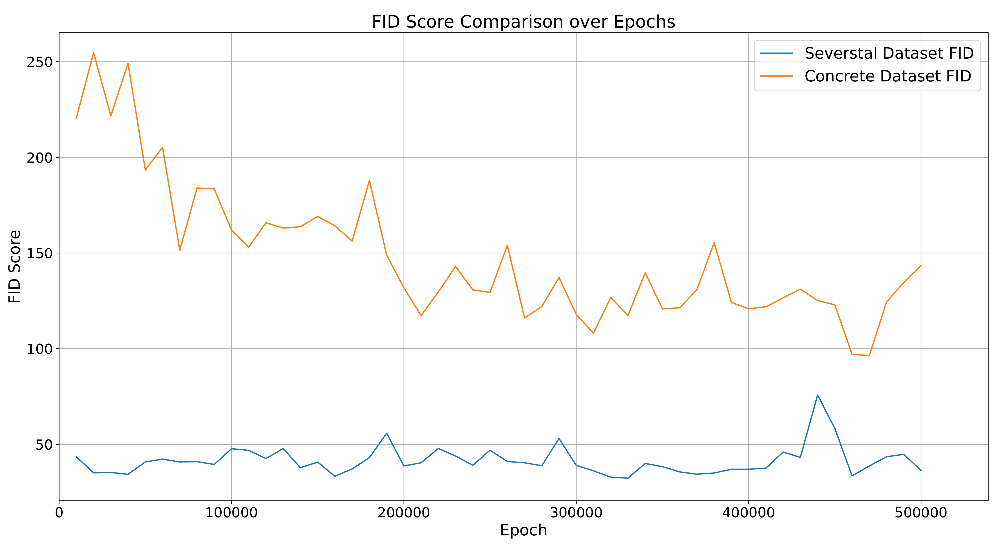

</br></br></br></br>
<h1> COIGAN: Controllable Object Inpainting through Generative Adversarial Network applied to Defect Synthesis for Data Augmentation</h1>
</br>

Revisited COIGAN project for the IROS 2024 conference. This project exploit the COIGAN training architecture to generate a dataset of defected images from a dataset of images from the new Morandi bridge located at Genova.

# Table of Contents
- [Table of Contents](#table-of-contents)
- [Model results](#model-results)
  - [Sample results](#sample-results)
  - [Dataset used for the training](#dataset-used-for-the-training)
    - [Concrete Crack Conglomerate Dataset](#concrete-crack-conglomerate-dataset)
    - [Severstal Steel Defect Detection dataset](#severstal-steel-defect-detection-dataset)
  - [Fid evaluation](#fid-evaluation)
- [Build the Docker image](#build-the-docker-image)
  - [Setup the build\_args file](#setup-the-build_args-file)
  - [Build the Docker image](#build-the-docker-image-1)
- [Run the Docker image](#run-the-docker-image)
- [Run the training](#run-the-training)
- [Run the evaluation](#run-the-evaluation)
- [Run the inference](#run-the-inference)

# Model results

## Sample results
Some results showing the effectiveness of the COIGAN model in generating defected over base images, in different contexts:


<figcaption style="text-align:center;">Results obtained from a COIGAN model trained on the Severstal steel defect detection dataset, using base images from the San Giorgio viaduct (Genoa, Italy).</figcaption>
</br></br>


<figcaption style="text-align:center;">Results obtained from a COIGAN model trained on the Concrete Crack Conglomerate Dataset, using base images from the San Giorgio viaduct (Genoa, Italy).</figcaption>
</br></br>

## Dataset used for the training

### Concrete Crack Conglomerate Dataset
The Conglomerate concrete crack dataset is a collection of images that focuses on detecting cracks in concrete structures. This dataset is widely used in the field of civil engineering and infrastructure inspection. It contains a variety of images showcasing different types and severities of cracks in concrete. It's a segmentation dataset, and contain only one class of defects: cracks, plus the background. This dataset is composed by a training set of 9,899 and a validation set composed by 1,096 images.

### Severstal Steel Defect Detection dataset
The Severstal steel defect detection dataset is designed for the task of detecting defects in steel surfaces. It consists of images capturing various types of defects that can occur during the manufacturing steel plates. The classes are 4 and are unlabeled, they are just numbers from 1 to 4. This dataset is composed by a 12,568 images with a shape of 256x1600 pixels. In this test we tiled the images in 7 slightly overlapping images of 256x256 pixels, to have a more manageable dataset, in the context of the COIGAN pipeline.

## Fid evaluation
The fid score calculated for the two datasets used for the training of the COIGAN model, are shown in the following figure.
The FID score was calculated between the training set and the generated images for the Severstal steel defect detection dataset. For the Concrete Crack Conglomerate Dataset a different setting was needed, the heavy difference between the training set and the base set used for the generation of the defected images brought us to chose to calculate the FID score between the generated images and the base images of the set, to have a more meaningful result, as drawback the base images available were only 1305, justifying the high value of the FID score.

<figure>
  <div style="display: flex; justify-content: center;">
    
  </div>
  <figcaption style="text-align:center;">FID results calculated on the COIGAN model trained on the Severstal steel defect detection dataset, and the Concrete Crack Conglomerate Dataset.
  </figcaption>
</figure>
</br>

# Build the Docker image

## Setup the build_args file
Before launching the build of the Docker image, you need to setup the `build_args.txt` file. This file contains the arguments used by the Dockerfile to build the image. The file is structured as follows:
```bash
--build-arg KAGGLE_USERNAME=<username>
--build-arg KAGGLE_KEY=<key>
--build-arg WANDB_API_KEY=<wandb_key>
```
where `<username>` and `<key>` are the username and the key of your Kaggle account. You can find them in the `Account` section of your Kaggle profile.
The `<wandb_key>` is the key of your Weights and Biases account. You can find it in the `Settings` section of your Weights and Biases profile.

## Build the Docker image
To build the Docker image, run the following command from the path ../COIGAN-IROS-2024/Docker:
```bash
docker build $(cat build_args.txt) -t coigan-iros-2024 .
```

# Run the Docker image
To run the Docker image, run the following command from the path ../COIGAN-IROS-2024/Docker:
```bash
docker run -it --gpus all --rm coigan-iros-2024
```
Or if you need to attach to the container only a subset of the system GPUs:
```bash
docker run -it --gpus '"device=0,1"' --rm coigan-iros-2024
```

# Run the training


# Run the evaluation


# Run the inference


